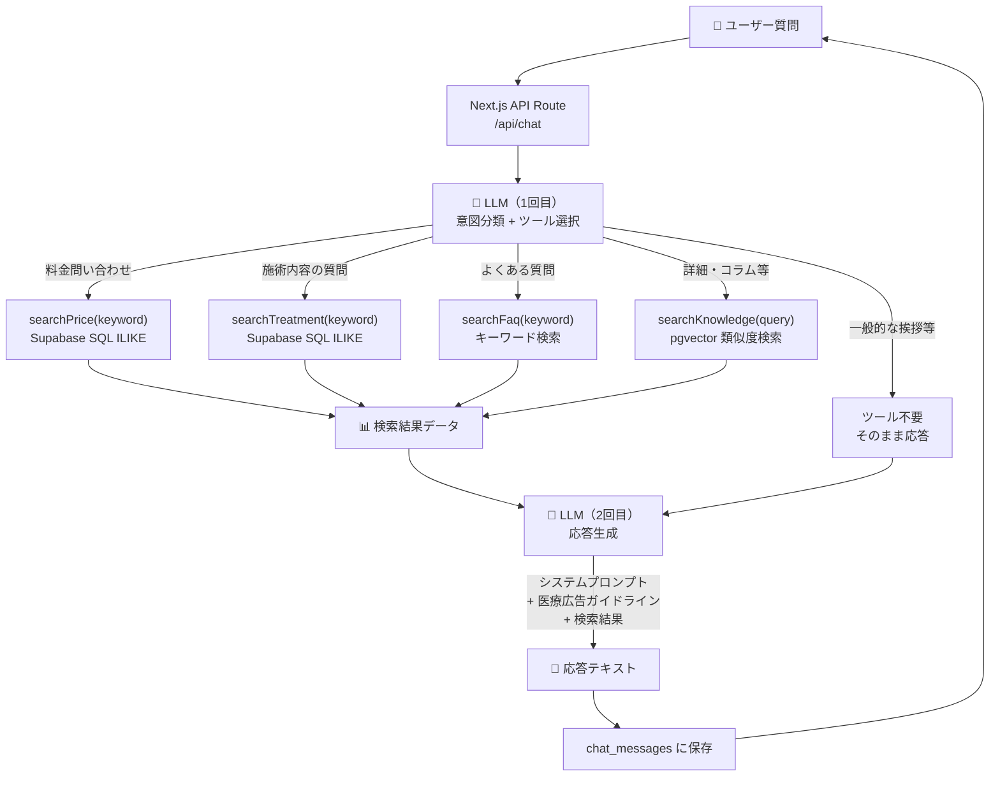
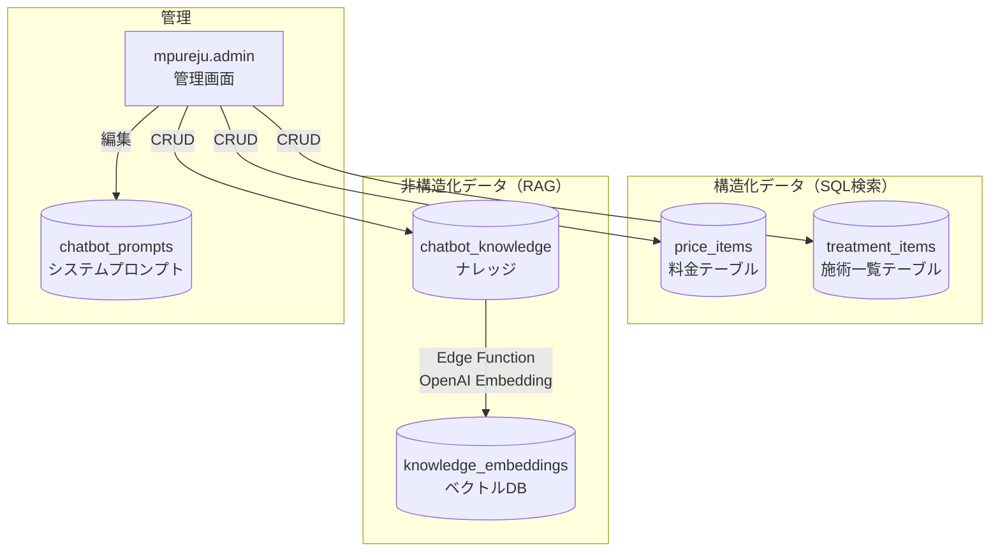
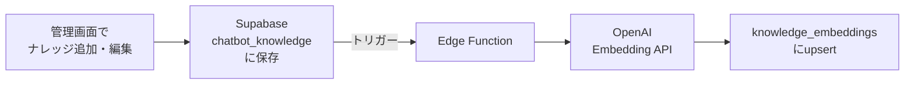

# Maison PUREJU 新サイト 要件定義書

## プロジェクト概要

**対象：** mpureju.com（銀座・美容外科クリニック）
**目的：** 現WordPress サイト（254ページ）を刷新し、SEO・CVR・管理効率を大幅改善する
**方針：** 新規ドメインに新規構築（既存サイトとは別に開発）

---

## 技術スタック

| 項目 | 採用技術 | 備考 |
|------|----------|------|
| Framework | Next.js 16 (App Router) | TypeScript必須 |
| Styling | Tailwind CSS v4 | |
| CMS | microCMS | コンテンツ全般を管理 |
| DB / Backend | Supabase | 管理機能・動的データ |
| Hosting | Vercel | |
| 予約システム | Medicalforce（外部） | 自前では作らない |
| アクセス解析 | Google Analytics 4 | |
| AI Chatbot | DeepSeek API | Phase 3以降 |

---

## microCMS スキーマ設計

| # | API名（日本語） | エンドポイント | 用途 | 主なフィールド |
|---|----------------|--------------|------|----------------|
| 1 | 施術情報 | `treatments` | 施術詳細ページのコンテンツ管理 | title, slug, pillar, catch_copy, description, recommended_for, procedure_flow, doctor_comment, hero_image, risks, downtime_min_days, downtime_max_days ※全フィールド必須。**料金は別API `prices` で管理**（後述） |
| 2 | 症例記事 | `cases` | 記事形式の症例コンテンツ。Instagram症例投稿から自動生成パイプラインでインポート。コラム記事と同じターミナル完結運用 | title, slug, pillar（セレクト）, treatment_label, timing, concern, risks, tags, thumbnail, images[], content（テキストエリア・Markdown）, instagram_url, published_at ※詳細は下記「cases 詳細スキーマ」参照 |
| 3 | お知らせ | `news` | クリニックからのお知らせ | title, content, category（notice/explanation/price-change）, thumbnail, published_at |
| 4 | コラム記事 | `columns` | ブログ・読み物コンテンツ。Instagramリールのロングフォーム展開先。**ナビゲーション表示名: 「美容コラム」**（英語の "Column" は使わない） | title, slug, content, category（**複数選択可**セレクト: treatment/skin-concern/beauty-goods/knowledge/lifestyle）, thumbnail, tags[], instagram_url（任意・元リールURL）, published_at |
| 5 | 院長プロフィール | `doctor` | 院長紹介ページ・Message セクション | name, title, photo, profile, message, career, qualifications[], media_appearances[], kol_activities |
| 6 | キャンペーン | `campaigns` | Campaign Bannerの管理 + 施術ページのサイドバー表示 | title, image, link_url, start_date, end_date, is_active, **related_treatments[]**（treatmentsへのリレーション） |
| 7 | よくある質問 | `faqs` | サイト表示用FAQ（ピラーページ・FAQページ） | question, answer, category（mouth/eye/nose/lift/skin/general/price/booking/recruit）, sort_order |
| 8 | セットコース | `setcourses` | 悩み別の施術組み合わせ提案 | title, tagline, concern, category, treatments[]（relation）, is_same_day, before_photo, after_photo, is_popular |
| 9 | スタッフ | `staff` | `/doctor/` ページのスタッフ紹介 + Team Slideの写真 | name, role（例：形成外科専門医・看護師等）, photo, profile, action_photos[]（施術中の様子）, sort_order |
| 10 | SNSメディア | `media` | トップページのMedia セクション。InstagramリールとYouTube動画のサムネイル + リンクを管理 | platform（`instagram` / `youtube`）, title（説明文・YouTube用）, thumbnail（MicroCMSImage）, url（投稿URL）, published_at |
| 11 | ~~採用情報~~ | ~~`recruit`~~ | **廃止** — 職種が3つのみのためハードコード運用に変更。APIは削除済み | — |
| 12 | スタッフブログ | `staff_blog` | `/recruit/staff-blog/` 採用ページ内のスタッフブログ | title, slug, thumbnail, body（richtext）, category[], published_at |
| 13 | 医療機器 | `machines` | `/machine/` 医療機器一覧・詳細ページ。フラットグリッド表示（カテゴリ廃止） | name, name_en, slug, thumbnail, type, catch_copy, target_concerns, description（richtext）, sort_order |
| 14 | 内服薬・処方薬 | `medicines` | `/medicine/` 内服薬一覧・詳細ページ。microCMS管理に移行 | name, slug, category（**セレクト**: 美肌・シミ対策 / 頭皮・毛髪ケア / AGA治療 / ニキビ・肌荒れ / ダウンタイム軽減 / まつ毛育成）, thumbnail, catch_copy, description（richtext）, usage, side_effects, contraindications, sort_order |
| 15 | サイト画像 | `site_images` | **未実装（予定）** — サイト各所の固定画像（ヒーロー・背景等）を一元管理。現在は `/public/` にハードコード | page_section（**セレクト**: top_fv / top_clinic_1 / top_clinic_2 / top_choose_1〜4 / top_doctor / persona_20s / persona_30s / persona_50s / persona_mens / pillar_mouth / pillar_eye / pillar_nose / pillar_lift / pillar_skin）, image, alt, sort_order |
| 16 | 営業カレンダー | `clinic_calendar` | **未実装（予定）** — 休診日管理。**オブジェクト形式**（1レコード）。詳細は下記参照 | regular_holidays（セレクト複数）, extra_holidays（テキストエリア）, cancel_holidays（テキストエリア） |

> **⚠️ 料金・施術一覧の管理方針（重要・設計変更 2026-03-27）：**
> 料金データ・施術一覧データは **microCMS ではなく Supabase で管理する**方針に変更。
> - **理由①：** AIチャットボット（Phase 3）が料金・施術データを直接参照するため、Supabase に一元化する方が同期不要で効率的
> - **理由②：** 構造化された表形式データで microCMS のリッチエディタ向きではない
> - **理由③：** 管理画面（`mpureju.admin`）から直接 CRUD できる
>
> **Supabase テーブル：**
> - `price_items` — 料金一覧ページ + 施術詳細サイドバー料金表示（旧 `lib/price-data.ts` のハードコードを置き換え）
> - `treatment_items` — 施術一覧ページ（旧 `app/treatment/page.tsx` のハードコードを置き換え）
>
> **データフロー：**
> ```
> Supabase price_items → /price/ ページ（ISR）
>                      → 施術詳細サイドバー（category 検索）
>                      → AIチャットボット（直接クエリ）
>
> Supabase treatment_items → /treatment/ ページ（ISR）
>                          → AIチャットボット（直接クエリ）
> ```
>
> **管理画面：** `mpureju.admin`（別リポジトリ）で CRUD。Supabase Auth で認証。
>
> ※ microCMS の `treatments` API は施術詳細記事ページ（`/mouth/[slug]/` 等）用。役割が異なるため共存する。
> ※ 旧方針の microCMS `prices` API 構想は廃止。
>
> **症例写真の管理方針（設計変更 2026-04-01）：** `cases` の Before/After 写真は `before_photo` / `after_photo` の個別管理を**廃止**。Instagram投稿の画像がすでにBefore/After結合済みのため、`thumbnail`（サムネ用結合画像）+ `images[]`（解説画像等）で管理する。コラム記事と同じ画像管理構造。`setcourses` の before/after は従来通り。
>
> **症例記事の本文は `content`（テキストエリア・Markdown）で管理。** リッチエディタは使わない。理由：Instagram投稿からの自動生成パイプライン（ターミナル完結）で運用するため。コラム記事と同じ方針。
>
> **料金情報は症例記事に含めない。** SSOT原則により料金は Supabase `price_items` のみで管理。症例記事のキャプションに料金が含まれていても、記事生成時に除外する。
>
> **チャットボットのプロンプト・RAGナレッジはmicroCMSで管理しない。** Supabaseテーブルで直接管理し、管理画面からCRUD操作する。

### treatments 詳細スキーマ

| # | フィールドID | 表示名 | 種類 | 必須 | 備考 |
|---|---|---|---|---|---|
| 1 | `title` | 施術名 | テキストフィールド | ✅ | |
| 2 | `slug` | URLスラッグ | テキストフィールド | ✅ | |
| 3 | `pillar` | 部位 | セレクトフィールド | ✅ | mouth / eye / nose / lift / skin |
| 4 | `catch_copy` | キャッチコピー | テキストフィールド | ✅ | 施術一覧・ピラーページで表示 |
| 5 | `description` | 施術説明 | リッチエディタ | ✅ | |
| 6 | `recommended_for` | こんな方におすすめ | リッチエディタ | ✅ | 箇条書き想定 |
| 7 | `procedure_flow` | 施術の流れ | リッチエディタ | ✅ | カウンセリング→施術→アフターケア等 |
| 8 | `doctor_comment` | ドクターコメント | テキストエリア | ✅ | |
| 9 | `hero_image` | メイン画像 | 画像 | ✅ | |
| 10 | `risks` | リスク・副作用 | リッチエディタ | ✅ | |
| 11 | `downtime_min_days` | DT最小日数 | 数字 | ✅ | シミュレーター用 |
| 12 | `downtime_max_days` | DT最大日数 | 数字 | ✅ | シミュレーター用 |

> **⚠️ 旧スキーマからの変更点：**
> - `category` → `pillar` にリネーム（部位の意味をより明確に）
> - `catch_copy` を新規追加（施術一覧・カード表示用のキャッチコピー）
> - `thumbnail` → `hero_image` にリネーム（メイン画像としての用途を明確に）
> - `risks` をテキストエリア → **リッチエディタ** に変更（箇条書き・太字等の書式が必要なため）
> - `price_options[]` を削除 → **独立 API `prices` に分離**（後述）
> - `downtime_milestones[]` は API 作成後にカスタムフィールド/繰り返しフィールドとして追加予定
> - **全フィールドを必須に設定**（下書き段階でも全項目入力を運用ルールとする）

### ~~recruit 詳細スキーマ~~ （廃止）

> **変更理由：** 募集職種が3つ（看護師・受付カウンセラー・広報）のみのため、microCMS管理は過剰と判断。`app/recruit/page.tsx` 内にハードコードで運用。APIエンドポイントは削除済み。

### staff_blog 詳細スキーマ

| # | フィールドID | 表示名 | 種類 | 必須 | 備考 |
|---|---|---|---|---|---|
| 1 | `title` | タイトル | テキストフィールド | ✅ | |
| 2 | `slug` | URLスラッグ | テキストフィールド | ✅ | |
| 3 | `thumbnail` | サムネイル | 画像 | ✅ | |
| 4 | `body` | 本文 | リッチエディタ | ✅ | |
| 5 | `category` | カテゴリ | セレクトフィールド（複数） | ❌ | |
| 6 | `published_at` | 公開日 | 日時 | ✅ | |

### machines 詳細スキーマ

> **設計変更（2026-03-24）：** `category` フィールドを廃止し、`target_concerns` を追加。一覧ページのカテゴリグルーピングを廃止しフラットグリッド表示に変更。理由：10台程度のマシン数ではカテゴリ分けが不要、1台しかないカテゴリが多く意味が薄い。`type` で技術種別、`target_concerns` でお悩みタグを表示。

| # | フィールドID | 表示名 | 種類 | 必須 | 備考 |
|---|---|---|---|---|---|
| 1 | `name` | マシン名 | テキストフィールド | ✅ | 例: ウルトラセルzi |
| 2 | `name_en` | マシン名（英語） | テキストフィールド | ✅ | 例: ULTRAcel zi |
| 3 | `slug` | スラッグ | テキストフィールド | ✅ | URL用。例: `ultracel-zi` → `/machine/ultracel-zi` |
| 4 | `thumbnail` | サムネイル画像 | 画像 | ✅ | 16:9。一覧カード・詳細ページで使用 |
| 5 | `type` | 種別 | テキストフィールド | ✅ | HIFU / RF / ニードルRF / レーザー / CO2レーザー / 光治療 / LEDライト / エレクトロポレーション |
| 6 | `catch_copy` | キャッチコピー | テキストフィールド | ✅ | 1行の概要説明。meta descriptionにも使用 |
| 7 | `target_concerns` | 対象のお悩み | テキストフィールド | ❌ | 例: たるみ / 毛穴・ニキビ跡。一覧カードにタグ表示 |
| 8 | `description` | 詳細説明 | リッチエディタ | ✅ | 詳細ページの本文 |
| 9 | `sort_order` | 表示順 | 数値 | ❌ | 小さい順に表示。未入力は末尾 |

### machines データ一覧（10台）

| マシン名 | type | target_concerns |
|---|---|---|
| ウルトラセルzi | HIFU | たるみ |
| サーマジェン | RF | たるみ |
| XERF（ザーフ） | RF | たるみ |
| ポテンツァ | ニードルRF | 毛穴・ニキビ跡 |
| サーマニードル | ニードルRF | 毛穴・ニキビ跡 |
| Q+C | レーザー | シミ・くすみ・赤み |
| CO2レーザー | CO2レーザー | ホクロ・イボ |
| セレックV | 光治療 | 幅広いお悩み |
| KOライト | LEDライト | ダウンタイム軽減・ニキビ・発毛 |
| メソナJ | エレクトロポレーション | 乾燥・くすみ・赤み |

> **採用ページ共通コンテンツの扱い：**
> 院長メッセージ・全職種共通の福利厚生・選考フロー・FAQはコード側にハードコード。
> - 院長メッセージは `doctor` API から取得も可
> - 採用FAQは `faqs` API に `category: recruit` を追加して管理

### clinic_calendar（営業カレンダー）

> **設計変更（2026-04-02）：** microCMS ではなく **Supabase** で管理する方針に変更。microCMS はコンテンツ管理に集中させ、構造化データ（休診日・料金等）は Supabase に統一する。
> 管理は `mpureju.admin` から CRUD。

**Supabase テーブル: `clinic_calendar`**

| カラム | 型 | 必須 | 備考 |
|---|---|---|---|
| `regular_holidays` | `text[]` | ✅ | 定休曜日。`['mon']` 等。現行は月曜定休 |
| `extra_holidays` | `date[]` | — | 臨時休診日。年末年始・GW・お盆・学会参加等 |
| `cancel_holidays` | `date[]` | — | 定休曜日だが営業する日。月曜祝日の振替営業等 |

**フロント側の休診判定ロジック:**
```
休診 = (曜日が regular_holidays に含まれる || 日付が extra_holidays に含まれる)
       && 日付が cancel_holidays に含まれない
```

**表示箇所（予定）:**
- `/reservation/` ページ内にカレンダーウィジェットとして配置
- トップページやフッター等にも埋め込み可能（コンポーネント化）
- 当月 + 翌月の2ヶ月表示
- 休診日はグレーアウト or ピンク背景で表示

### cases 詳細スキーマ

> **設計確定: 2026-04-01**
> Instagram症例投稿を元に記事を自動生成し、microCMS に投稿するパイプラインで運用。コラム記事（`columns`）と同一の運用フローを採用。

| # | フィールドID | 表示名 | 種類 | 必須 | 備考 |
|---|---|---|---|---|---|
| 1 | `title` | タイトル | テキストフィールド | ✅ | 30-60字。SEO意識。例: `ヒアルロン酸注入で整える横顔｜あご+唇で小顔効果` |
| 2 | `slug` | スラッグ | テキストフィールド | ✅ | 形式: `{pillar}-{3桁連番}`。例: `mouth-001`, `eye-003` |
| 3 | `pillar` | 部位カテゴリ | セレクトフィールド（**複数選択可**） | ✅ | 選択肢（表示名）: `口元` / `目元` / `鼻` / `リフトアップ` / `美容皮膚科`。コンビネーション治療など複数部位にまたがる症例に対応 |
| 4 | `treatment_label` | 施術名 | テキストフィールド | ✅ | カンマ区切り。例: `糸リフト,サーマジェン,ヒアルロン酸`。施術詳細ページからの逆引きフィルターキー（`treatment_label[contains]施術名` で検索） |
| 5 | `timing` | 経過タイミング | テキストフィールド | ❌ | 例: `直後` / `1週間後` / `1ヶ月後`。キャプションに記載がない場合は空 |
| 6 | `concern` | お悩み・改善ポイント | テキストフィールド | ✅ | カンマ区切り。例: `口元の突出感,人中の長さ,Eライン` |
| 7 | `risks` | リスク・副作用 | テキストフィールド | ✅ | 医療広告ガイドライン必須。例: `腫れ、内出血、左右差、血流障害` |
| 8 | `tags` | タグ | テキストフィールド | ❌ | カンマ区切り。検索・SEO用 |
| 9 | `thumbnail` | サムネイル | 画像 | ✅ | Before/After結合画像（一覧カード表示用） |
| 10 | `images` | 症例画像 | 複数画像 | ❌ | サムネ以外の解説画像 |
| 11 | `content` | 本文 | テキストエリア | ✅ | Markdown形式。料金情報は含めない（SSOT: Supabase管理） |
| 12 | `instagram_url` | Instagram URL | テキストフィールド | ❌ | 元投稿URL |
| 13 | `published_at` | 公開日 | 日時 | ✅ | |

#### フロントエンド表示箇所と取得ロジック

| 表示箇所 | ページ例 | フィルター条件 | 取得関数 |
|---|---|---|---|
| トップページ 症例実績セクション | `/` | pillar タブ切替 | `getCasesByPillar(pillar)` → `pillar[contains]{表示名}` |
| 部位ページ 症例実績セクション | `/mouth/` | pillar 固定（ページに紐づく） | `getCasesByPillar("口元")` → `pillar[contains]口元` |
| 施術詳細ページ 症例写真セクション | `/mouth/corner-lip-lift/` | 施術名で部分一致 | `getCasesByTreatment("口角挙上")` → `treatment_label[contains]口角挙上` |
| 症例一覧ページ | `/case/` | pillar タブ + 全件 | `getCaseList()` + フロントフィルター |

> **`treatment_label` のマッチング方式：** microCMS の `[contains]` フィルターで部分一致検索。`treatment_label` が `M字リップ,口角挙上` の場合、「M字リップ」でも「口角挙上」でもヒットする。表記は treatments API の `title` に揃えること。

#### slug 命名規則

| pillar（表示名） | slug prefix | 例 |
|---|---|---|
| 口元 | `mouth-` | `mouth-001`, `mouth-002` |
| 目元 | `eye-` | `eye-001` |
| 鼻 | `nose-` | `nose-001` |
| リフトアップ | `lift-` | `lift-001` |
| 美容皮膚科 | `skin-` | `skin-001` |

`public/case/CASE_INDEX.md` で各カテゴリの採番を管理（コラムの `COLUMN_INDEX.md` と同じ運用）。

#### 記事コンテンツテンプレート（article.md の本文構造）

すべての症例記事は以下のセクション構成に統一する。スキルによる自動生成時もこの順序・構造を守ること。

```markdown
---
title: "タイトル"
slug: "mouth-001"
pillar:
  - "口元"
treatment_label: "M字リップ,口角挙上"
timing: "1週間後"
concern: "上唇の厚み,口角の形,笑いやすさ"
risks: "腫れ、内出血、左右差、傷痕、硬結、後戻り、血流障害"
tags: "口角挙上,M字リップ,唇整形,口元"
thumbnail: "image_1.jpg"
instagram_url: ""
published_at: "2026-04-01"
---

## この症例について

施術の概要を2-3文で説明。
何を目的に、どの施術を行ったかを簡潔に。

## 施術のポイント

この症例で特に注目すべき点を解説。
- なぜこの施術（組合せ）を選んだか
- どこがどう変化したか
- 画像内の注釈テキストがあればそれを文章で補足

## 施術詳細

| 施術内容 | 詳細 |
|---------|------|
| 施術名 | （例: M字リップ + 口角挙上） |
| 施術部位 | （例: 上唇・口角） |
| 経過 | （例: 1週間後 ※腫れあり） |

## こんな方に向いています

- 箇条書きで対象者を列挙
- キャプションの内容を元に
（※ キャプションに該当情報がない場合は省略可）

## 注意事項

経過写真についての補足（腫れが残っている、今後馴染む等）。
ダウンタイムに関する事実ベースの情報。
（※ 経過写真でない場合は省略可）
```

**コンテンツテンプレート ルール:**

1. **セクション順序は固定** — 上記の順番を必ず守る
2. **「この症例について」は必須** — 最低2文
3. **「施術のポイント」は必須** — 画像に注釈テキストがある場合はそれを反映
4. **「施術詳細」テーブルは必須** — 施術名・施術部位・経過の3行は固定
5. **「こんな方に向いています」は条件付き** — キャプションに該当情報がある場合のみ記載。なければセクションごと省略
6. **「注意事項」は条件付き** — 経過写真の場合のみ（「まだ腫れています」等）。なければセクションごと省略
7. **料金情報は絶対に書かない** — SSOT原則。キャプションの【価格】セクションは完全に無視する
8. **リスク・副作用は本文に書かない** — frontmatter の `risks` フィールドで管理し、フロント側で定型表示する
9. **断定表現・効果保証表現の禁止** — 医療広告ガイドライン準拠（「〜できます」ではなく「〜が期待できます」）
10. **句点で改行** — コラム記事と同じ表記ルール

#### パイプライン（コラムと同一構造）

```
public/case/urls.txt             ← Instagram URL リスト
  ↓
scripts/instagram-dl.sh          ← 画像 + caption.txt ダウンロード
  ↓
case-article-creator スキル       ← caption.txt + 画像から article.md 自動生成
  ├── pillar / treatment_label / timing / concern / risks を自動抽出
  ├── 料金情報（【価格】セクション）は除外
  └── slug は CASE_INDEX.md で採番管理
  ↓
scripts/microcms-case-post.js    ← cases API に投稿
  ├── thumbnail + images アップロード
  ├── urls.txt に完了マーク
  └── CASE_INDEX.md 更新
```

#### 既存コンポーネントへの影響

| コンポーネント | 現状 | 変更内容 |
|---|---|---|
| `CaseCarousel.tsx` | ハードコードのモックデータ（10件） | microCMS `cases` API から動的取得に切替。`pillar` フィルター対応 |
| `TreatmentDetailTemplate.tsx` | 「症例写真は準備中です」表示 | `getCasesByTreatment(施術名)` で `treatment_label` 部分一致検索し関連症例カードを表示 |
| `PillarTemplate.tsx` | CaseCarousel をモックで呼出 | Server Component 側で `getCasesByPillar()` 取得 → props で渡す |

---

## 開発参照ドキュメント（コンテンツ整備用）

施術名・料金データは microCMS 接続前の開発フェーズにおいて、以下のファイルで管理する。

| ファイル | 内容 | 用途 |
|---------|------|------|
| `docs/treatment-menu.md` | 施術名・概要・リスク副作用一覧 | 現行WordPressより抽出。施術コンテンツ整備・microCMS投入の起点。 |
| `docs/price-list.md` | 全施術・化粧品の料金一覧（税込） | WordPressコードエディタ出力から整理。microCMS `prices` API への投入データ。 |
| `docs/codeediter` | WordPressコードエディタ出力（raw） | 現行サイトの PRICE ページ ブロック構造そのまま。参照・検証のみ。直接編集不可。 |

**料金データの流れ:**

```
現行WordPress（ブロックエディタ）
  ↓ 手動抽出
docs/price-list.md（開発参照ドキュメント）
  ↓ Supabase 投入時に参照（supabase/003_seed_price_items.sql）
Supabase price_items テーブル（本番単一ソース）
  ↓ Supabase API取得（ISR）
/price/ ページ（price_items 直接取得）
施術詳細ページ サイドバー（category 検索で該当行を取得）
AIチャットボット（直接クエリ）
```

> **注意:** 料金変更は Supabase の `price_items` テーブルのみを更新すること。管理画面（`mpureju.admin`）から CRUD 操作する。
> `lib/price-data.ts`（ハードコード）は Supabase 移行完了後に廃止予定。

---

## フロントエンド設計方針

### 施術詳細ページ（共通テンプレート方式）

5ピラー（mouth / eye / nose / lift / skin）の施術詳細ページは `TreatmentDetailTemplate` コンポーネントで統一。

```
components/pillar/TreatmentDetailTemplate.tsx  ← 共通テンプレート（UI全体）
app/{pillar}/[slug]/page.tsx                   ← ピラー固有の設定 + データ取得のみ（約50行）
```

**`PillarInfo`（各ページが渡す設定）:**
- `slug` — ピラー識別子（例: "mouth"）
- `label` — パンくず表示名（例: "口元"）
- `caseLabel` — 症例リンクテキスト
- `sidebarLabel` — サイドバー見出し

### CSS 運用ルール

| 対象 | 配置場所 | 理由 |
|------|---------|------|
| 一般的なカスタムクラス | `@layer components {}` 内 | Tailwind ユーティリティに負けないよう |
| `prose` の上書きが必要なスタイル（`.table-scroll-wrapper` 等） | `@layer` の外（unlayered） | `@tailwindcss/typography` は utilities 層に入るため、components 層では負ける |

### フォント運用方針

- **明朝体（Noto Serif JP）**: ページタイトル・セクション見出し（ゴールドバー付き h2）などアクセント用途に限定
- **記事コンテンツ内の見出し**: ゴシック体（Noto Sans JP）+ `font-light` + `tracking-wide` で差別化。明朝体は使わない（冷たい印象を避けるため）
- **テーブル**: ゴシック体統一

### テーブルスタイル（`.table-scroll-wrapper`）

microCMS リッチエディタの `<table>` を `RichContent` コンポーネントが自動でラップ。

- **デスクトップ（768px〜）**: `table-layout: fixed`（均等列幅）、クリームグラデヘッダー、ホバーハイライト
- **モバイル（〜767px）**: テーブルを CSS でカード型に変換。`thead` 非表示、各 `td` に `data-label` 属性でヘッダーテキストを表示

---

## 予約・問い合わせ導線

```
ユーザー
  ↓
各ページの [Web予約] ボタン
  └── Medicalforce（外部予約システム）← 予約はすべてここで完結

[LINE相談] ボタン
  └── LINE公式アカウント → 最終的にMedicalforceで予約

[お問い合わせフォーム]（サイト内に新設）
  └── Supabase inquiries テーブルに保存
  └── 管理画面で一覧・ステータス管理
```

---

## Supabase 設計

### 役割分担
```
microCMS  → 施術詳細記事・症例・コラム等（リッチコンテンツ管理）
Supabase  → 料金・施術一覧・問い合わせ・ログ・管理機能（構造化データ + アプリケーションデータ）
GA4       → PV・セッション等の基本アクセス解析
```

### テーブル設計

#### `treatment_items`（施術一覧ページ用）
> 追加: 2026-03-27。SQL: `supabase/001_create_tables.sql` + `supabase/002_seed_treatment_items.sql`

| カラム | 型 | 説明 |
|--------|----|------|
| id | bigint (identity) | PK |
| section | text | 皮膚科 / 外科 / 点滴 / 内服薬 |
| sub_tab | text nullable | 目 / 鼻 / 口 等（外科のみ。他はnull） |
| name | text | 施術名 |
| description | text | 概要 |
| risks | text | リスク・副作用 |
| sort_order | int | 表示順 |
| created_at | timestamptz | |
| updated_at | timestamptz | トリガーで自動更新 |

#### `price_items`（料金一覧ページ + 施術詳細サイドバー用）
> 追加: 2026-03-27。SQL: `supabase/001_create_tables.sql` + `supabase/003_seed_price_items.sql`

| カラム | 型 | 説明 |
|--------|----|------|
| id | bigint (identity) | PK |
| section | text | 皮膚科 / 外科 / 点滴 / 内服薬 / 化粧品 / その他 |
| sub_tab | text | ヒアルロン酸 / ボトックス 等 |
| category | text | 施術名/グループ名（空文字＝前行の継続） |
| option | text nullable | オプション（1本, 2本 等） |
| price | text | 税込価格（例: ¥99,000） |
| sort_order | int | 表示順 |
| created_at | timestamptz | |
| updated_at | timestamptz | トリガーで自動更新 |

> **RLSポリシー:** 両テーブルとも `SELECT` は全公開、`INSERT/UPDATE/DELETE` は `service_role_key` のみ（管理画面経由）

#### `inquiries`（問い合わせ管理）
| カラム | 型 | 説明 |
|--------|----|------|
| id | UUID | PK |
| name | varchar | お名前 |
| email | varchar | メールアドレス |
| phone | varchar nullable | 電話番号 |
| subject | varchar | 件名 |
| message | text | 本文 |
| status | enum | `unread` / `in_progress` / `done` |
| assigned_to | UUID nullable | 担当スタッフ（auth.users参照） |
| created_at | timestamp | 受信日時 |
| updated_at | timestamp | 更新日時 |

#### `conversion_events`（重要イベント記録）
| カラム | 型 | 説明 |
|--------|----|------|
| id | UUID | PK |
| event_type | enum | `booking_click` / `line_click` / `phone_click` |
| page_url | varchar | クリック元ページ |
| created_at | timestamp | 発生日時 |

> GA4でカバーしきれない「どのページから予約ボタンを押したか」等を自前で計測

#### `chat_sessions`（チャットボット・Phase 3用）
| カラム | 型 | 説明 |
|--------|----|------|
| id | UUID | セッションID（PK） |
| page_url | varchar | チャット開始ページ |
| user_agent | varchar | デバイス情報 |
| started_at | timestamp | 開始日時 |
| ended_at | timestamp nullable | 終了日時 |

#### `chat_messages`（チャットボット・Phase 3用）
| カラム | 型 | 説明 |
|--------|----|------|
| id | UUID | PK |
| session_id | UUID | FK → chat_sessions |
| role | enum | `user` / `assistant` |
| content | text | メッセージ内容 |
| created_at | timestamp | 送信日時 |

#### `chatbot_knowledge`（RAGナレッジ・Phase 3用）
> `chatbot_faqs` は廃止。FAQも含めすべてのナレッジをこのテーブルに統一。
| カラム | 型 | 説明 |
|--------|----|------|
| id | UUID | PK |
| title | varchar | ナレッジのタイトル（管理用） |
| content | text | チャンク単位のテキスト |
| category | varchar | 料金 / 予約 / 施術 / クリニック情報 等 |
| is_active | boolean | 有効/無効 |
| created_at | timestamp | |
| updated_at | timestamp | |

#### `chatbot_prompts`（プロンプト管理・Phase 3用）
| カラム | 型 | 説明 |
|--------|----|------|
| id | UUID | PK |
| name | varchar | 識別名（例：`system_prompt` / `medical_guidelines`） |
| content | text | プロンプト本文 |
| is_active | boolean | 有効/無効 |
| version | integer | 変更履歴用バージョン番号 |
| updated_at | timestamp | |

#### `knowledge_embeddings`（RAGベクトルDB・Phase 3用）
| カラム | 型 | 説明 |
|--------|----|------|
| id | UUID | PK |
| knowledge_id | UUID | FK → chatbot_knowledge |
| content | text | 元テキスト（検索結果として返す） |
| embedding | vector(1536) | ベクトル（pgvector拡張） |
| updated_at | timestamp | knowledge更新時に自動再生成 |

### チャットボットアーキテクチャ（Phase 3）

> **設計方針（2026-03-27確定）：ハイブリッド検索 + LLM応答生成**
> - **構造化データ**（料金・施術一覧）→ TypeScript で Supabase SQL 検索（正確性を担保）
> - **非構造化データ**（施術の詳しい説明・コラム記事等）→ pgvector RAG（意味検索）
> - LLM は「意図分類」と「応答生成」に専念。データ検索自体は行わない
>
> **理由：** 料金や施術名をLLMに丸投げすると幻覚リスクがある。構造化データはSQL検索で正確に引き、LLMは自然言語の理解と応答文の生成に使う。

#### Tool Use（Function Calling）設計

LLM に以下のツール（関数）を定義し、必要に応じて呼び出させる：

| ツール名 | 引数 | 処理 | データソース |
|----------|------|------|-------------|
| `searchPrice` | keyword: string | 施術名で料金を検索 | `price_items`（SQL ILIKE） |
| `searchTreatment` | keyword: string | 施術の概要・リスクを検索 | `treatment_items`（SQL ILIKE） |
| `searchFaq` | keyword: string | FAQを検索 | `faq_items` or ハードコード |
| `searchKnowledge` | query: string | 自由文で関連ナレッジを検索 | `knowledge_embeddings`（pgvector） |

#### 応答フロー図





#### ナレッジ登録フロー（RAG用）



> microCMSは一切介在しない。すべてSupabase + 管理画面で完結。

### 管理画面（`mpureju.admin` — 別リポジトリ）

> **設計変更（2026-03-27）：** 管理画面を `mpureju.site` 内の `/admin/` から独立リポジトリ `mpureju.admin` に分離。フロントサイトとの依存を切り、独立してデプロイ・開発できるようにする。

**Phase 1から実装：**
- **認証：** Supabase Auth（メール＋パスワード）
- **施術一覧管理：** `treatment_items` の CRUD・並び替え
- **料金管理：** `price_items` の CRUD・並び替え
- **問い合わせ一覧：** ステータス管理・担当割り当て

**Phase 3で追加：**
- **会話ログ：** セッション一覧・メッセージ履歴確認
- **ナレッジ管理：** chatbot_knowledgeのCRUD・embedding再生成
- **プロンプト管理：** chatbot_promptsの編集・バージョン確認

---

## サイト構造（全体）

```
/                     トップページ
/price/               料金表
/contact/             予約・お問い合わせ（Medicalforce / LINEへ誘導）

/mouth/               口元 [ピラーページ]
  /mouth/corner-lip-lift/    口角挙上
  /mouth/m-lip/       M字リップ
  /mouth/philtrum/    人中短縮
  /mouth/lip-reduction/ 口唇縮小
  /mouth/gummy-smile/ ガミースマイル
  /mouth/case/        口元症例一覧

/eye/                 目元 [ピラーページ]
  /eye/double-eyelid/ 二重整形
  /eye/ptosis/        眼瞼下垂
  /eye/brow-lift/     眉下切開
  /eye/under-eye/     目の下のたるみ・クマ
  /eye/epicanthoplasty/ 目頭切開
  /eye/case/          目元症例一覧

/nose/                鼻 [ピラーページ]
  /nose/implant/      プロテーゼ
  /nose/tip/          鼻尖形成
  /nose/alar/         鼻翼縮小
  /nose/septum/       鼻中隔
  /nose/case/         鼻症例一覧

/lift/                リフトアップ [ピラーページ]
  /lift/thread/       糸リフト
  /lift/sofwave/      ソフウェーブ
  /lift/hifu/         HIFU
  /lift/case/         リフトアップ症例一覧

/skin/                美容皮膚科 [ピラーページ]
  /skin/potenza/      ポテンツァ
  /skin/injection/    注入治療
  /skin/laser/        レーザー治療
  /skin/case/         皮膚科症例一覧

/treatment/           施術一覧（全施術を横断的に掲載）← 「施術名から探す」のリンク先
/simulator/           料金・ダウンタイムシミュレーター（独立ページ）

/case/                症例写真総合（フィルター検索）
/doctor/              院長紹介・実績
/column/              コラム・FAQ
  /column/faq/        よくある質問
/news/                お知らせ
/contact/             お問い合わせ（フォーム + LINE/Medicalforceへの誘導）
/machine/             医療機器一覧（カテゴリ別カードグリッド）
/machine/[slug]/      医療機器詳細
/recruit/             採用情報一覧
/recruit/[slug]/      求人詳細
/about/               クリニック紹介・院長・アクセス統合
/reservation/         予約ガイド（Web予約・LINE予約・電話の手順・初診の流れ）
/first-visit/         初めての方へ（カウンセリングの流れ・当日の持ち物・注意事項）
/aftercare/           アフターケアガイド（施術後の過ごし方・緊急連絡先）
/commitment/          当院のこだわり（衛生管理・使用機器・麻酔方針）
/comparison/          施術比較（埋没 vs 切開、糸リフト vs 切開リフト等）
/payment/             お支払い方法（クレジット・医療ローン詳細・分割シミュレーション）
/glossary/            美容医療用語集（SEOロングテール狙い）
/campaign/            キャンペーン一覧
/monitor/             モニター募集（割引条件・対象施術・応募フォーム）
/sitemap/             サイトマップ
```

---

## トップページ ナビゲーション設計

### 「お悩みから探す」と「施術名から探す」の導線統一

どちらのセクションからも、最終的に**同じ施術詳細ページ**に辿り着く設計とする。

```
お悩みから探す（顔SVG インタラクティブUI）
  └→ 部位クリック（例: 口元）→ /mouth/（ピラーページ）
       └→ ピラーページ内の施術リスト → /mouth/corner-lip-lift/ 等（施術詳細）

施術名から探す（タブUI）
  └→ 口元タブ → 「口角挙上」クリック → /mouth/corner-lip-lift/（施術詳細）
```

### 施術詳細ページのURL設計

| 種別 | URL形式 | 例 |
|-----|--------|----|
| ピラー主要施術 | `/[pillar]/[slug]/` | `/mouth/corner-lip-lift/` |
| その他全施術 | `/treatment/[slug]/` | `/treatment/peanut-lip/` |

**ピラー主要施術（定義済みURL）:**
- 口元: `/mouth/corner-lip-lift` `/mouth/m-lip` `/mouth/philtrum` `/mouth/lip-reduction` `/mouth/gummy-smile`
- 目元: `/eye/double-eyelid` `/eye/ptosis` `/eye/brow-lift` `/eye/under-eye` `/eye/epicanthoplasty`
- 鼻: `/nose/implant` `/nose/tip` `/nose/alar` `/nose/septum`
- リフトアップ: `/lift/thread` `/lift/sofwave` `/lift/hifu`
- 美容皮膚科: `/skin/potenza` `/skin/injection` `/skin/laser`

**上記以外の施術**（ハムラ法・脂肪吸引・ピーリング等）は `/treatment/[slug]/` を使用。

### Phase別対応

| Phase | 状態 |
|-------|------|
| Phase 1 | 施術詳細ページ未実装。タブのリンクは404になるが許容。 |
| Phase 2 | 全施術詳細ページを実装。microCMS `treatments` スキーマと連携。TreatmentTabsも動的取得に切り替え。 |

---

## ページ別セクション構成

### トップページ（`/`）
> 参考デザイン：LIANクリニック（上品・清潔感・ベージュトーン）

| # | セクション | 内容 |
|---|-----------|------|
| 1 | **Hero** | クリニック内観写真・ロゴ・グローバルナビ |
| 2 | **Campaign Banner** | キャンペーンのバナー画像（横幅全体 or カード型）。複数ある場合はスライダー対応 |
| 3 | **お悩みから探す（Face Menu）** | 顔写真に各部位へのラベルを線で繋いだインタラクティブUI。ラベルをクリックすると各ピラーページへ遷移。対象部位：目元 / 鼻 / 口元 / リフトアップ・たるみ / 美容皮膚科。実装：SVGまたはCSSの絶対配置でラベルを顔写真上に配置、線はSVG lineで描画。スマホでは縦並びリストに切り替え。 |
| 4 | **施術名から探す** | **タブUI**（口元 / 目元 / 鼻 / リフトアップ / 美容皮膚科）。タブ切替で各カテゴリの施術名リストを表示。各施術名リンクの遷移先は下記「ナビゲーション設計」を参照。Phase 1では詳細ページ未実装のため一部404となるが許容。 |
| 5 | **症例実績（Case Results）** | Phase 1ではUIブロック・カルーセルの枠のみ実装。コンテンツはmicroCMS（casesスキーマ）から取得する構造を用意し、データは後からインポート。部位別タブ（口元/目元/鼻/リフト/皮膚科）→ /case/ |
| 6 | **Media** | 雑誌掲載・TV出演・KOL実績など |
| 7 | **内観フルワイド写真** | クリニック内装の全幅写真 |
| 8 | **Value** | 選ばれる理由4項目：形成外科専門医 / 完全個室 / 銀座 / こだわりの技術 |
| 9 | **Message** | 廣瀬院長の写真 + メッセージ文 |
| 10 | **Team Slide** | セクションタイトル（例：「Introduction of our Team」）+ 説明文 + `staff.action_photos[]` から取得したアクションショットを横方向に無限ループ表示。実装：CSS animation（translateX）または Embla Carousel等で無限ループ。 |
| 11 | **News** | 最新お知らせ3〜5件 → /news/ |
| 12 | **内観フルワイド写真②** | 別アングルのクリニック内装 |
| 13 | **Access** | 地図・最寄駅・診療時間・休診日 |
| 14 | **Reserve CTA** | [LINE相談] [Web予約] ボタン |
| 15 | **Footer** | サイトマップ・各種リンク |

---

### ピラーページ共通（`/mouth/` `/eye/` `/nose/` `/lift/` `/skin/`）

| # | セクション | 内容 |
|---|-----------|------|
| 1 | **Hero** | 部位タイトル + キャッチコピー + 症例数などの実績 |
| 2 | **こんなお悩みの方へ** | 悩み別タグ一覧（旧troubleページをここに統合） |
| 3 | **施術一覧** | 各施術カード（施術名・概要・料金目安）→ 各詳細ページ（Phase 2） |
| 4 | **おすすめセットコース** | `setcourses` から該当カテゴリのコースを表示。悩み×セット施術の組み合わせ提案 |
| 5 | **施術の選び方** | 悩み × 施術の対応表 |
| 6 | **シミュレーター（埋め込み）** | 料金・ダウンタイムシミュレーターをこのページの部位施術に絞って表示。`/simulator/` へのリンクも併設 |
| 7 | **院長のこだわり** | 形成外科的アプローチの説明 + 廣瀬院長コメント・写真 |
| 8 | **症例写真** | この部位の厳選ケース数件 → /[部位]/case/ |
| 9 | **よくある質問** | この部位に関するQ&A（5〜8問） |
| 10 | **CTA** | 「まずはカウンセリングから」[LINE相談] [Web予約] |

---

### ドクター・スタッフページ（`/doctor/`）

| # | セクション | 内容・データソース |
|---|-----------|----------------|
| 1 | **Hero** | ページタイトル + クリニックのキャッチコピー |
| 2 | **クリニック紹介** | Maison PUREJUのコンセプト・理念・施設紹介。内観写真複数枚 |
| 3 | **院長紹介** | `doctor` スキーマから取得。写真・経歴・専門医資格・メディア実績・KOL活動 |
| 4 | **スタッフ紹介** | `staff` スキーマから取得。メンバー一覧（顔写真・名前・役職・一言プロフィール） |
| 5 | **CTA** | [LINE相談] [Web予約] |

---

### 料金一覧（`/price/`）

| # | セクション | 内容 |
|---|-----------|------|
| 1 | **ヘッダー** | 「施術料金表」タイトル + 「すべて税込総額表示」の明記 |
| 2 | **カテゴリ別料金表** | 口元 / 目元 / 鼻 / リフトアップ / 美容皮膚科 / 内服薬 |
| 3 | **注意事項** | 麻酔・オプション等の補足・モニター価格案内 |
| 4 | **お支払い方法** | クレジットカード・医療ローン等 |
| 5 | **医療費控除** | 医療費控除の対象について |
| 6 | **CTA** | 「詳細はカウンセリングで」[Web予約] [LINE相談] |

---

## フェーズ計画

最終更新: 2026-03-30

### Phase 1（現在のスコープ）

**実装済み:**
- [x] プロジェクト初期設定（Next.js + microCMS + Supabase + Tailwind）
- [x] 環境変数設定（Vercel）
- [x] 共通レイアウト（Header・Footer・スマホ固定フッター）
- [x] グローバルナビゲーション（メガメニュー）
- [x] トップページ（`/`）
- [x] 口元ピラーページ（`/mouth/`）— microCMS 動的取得 + フォールバック
- [x] 目元ピラーページ（`/eye/`）— 同上
- [x] 鼻ピラーページ（`/nose/`）— 同上
- [x] リフトアップピラーページ（`/lift/`）— 同上
- [x] 美容皮膚科ピラーページ（`/skin/`）— 同上
- [x] 施術詳細ページ（`/[pillar]/[slug]/`）— 全5ピラー・`TreatmentDetailTemplate` 共通テンプレート
- [x] 施術詳細 FAQ セクション（`lib/faq-data.ts`・48施術 × 5問）
- [x] 医療機器一覧（`/machine/`）— フラットグリッド・6件/ページネーション
- [x] 医療機器詳細（`/machine/[slug]/`）— キャンペーンサイドバー対応
- [x] 内服薬一覧（`/medicine/`）— カテゴリ別カードグリッド ※microCMS未接続・ハードコード運用中
- [x] 内服薬詳細（`/medicine/[slug]/`）— ※同上
- [x] 施術一覧ページ（`/treatment/`）※Supabase未接続・ハードコード運用中
- [x] シミュレーターページ（`/simulator/`）— react-day-picker + date-fns
- [x] 料金一覧ページ（`/price/`）※Supabase未接続・ハードコード運用中
- [x] お問い合わせページ（`/contact/`）— UI完了 ※Supabase送信未実装
- [x] お知らせ一覧（`/news/`）・詳細（`/news/[slug]/`）
- [x] 検索ページ（`/search/`）
- [x] 採用情報（`/recruit/`）※職種はハードコード運用
- [x] エントリーフォーム（`/recruit/entry/`）— UI完了 ※Supabase送信未実装
- [x] スタッフブログ詳細（`/recruit/staff-blog/[slug]/`）
- [x] よくあるご質問（`/column/faq/`）— ハードコード運用中
- [x] 予約・ご来院の流れ（`/reservation/`）— 基本構造完了 ※営業カレンダーウィジェット未実装
- [x] プライバシーポリシー（`/privacy`）
- [x] 医療広告ガイドライン（`/medical-guidelines`）
- [x] キャンセルポリシー（`/cancel-policy`）
- [x] 特定商取引法（`/legal`）
- [x] Supabase プロジェクト作成・`treatment_items` / `price_items` テーブル設計・データ投入
- [x] チャットボット UI 枠（`ChatBot.tsx`）— Phase 3 先行実装・バックエンド未接続

**未実装（Phase 1 残タスク）:**
- [ ] スタッフブログ一覧（`/recruit/staff-blog/`）— 詳細のみ存在
- [ ] 管理画面ベース（`/admin/`）— Supabase Auth 認証 + 問い合わせ管理
- [ ] Supabase inquiries 連携（お問い合わせ・エントリーフォーム送信）
- [ ] 料金・施術一覧の Supabase 読み込み切り替え（`/price/`・`/treatment/`）
- [ ] 内服薬の microCMS `medicines` API 接続（コンテンツ投入 → ハードコード廃止）
- [ ] 予約ページ 営業カレンダーウィジェット（microCMS `clinic_calendar` API）

### Phase 1.5（追加コンテンツページ — 未着手）

`/first-visit/` は `/reservation/` に統合済み（設計変更）。

| ページ | 優先度 | 状態 | 内容 |
|--------|--------|------|------|
| `/about/` | 高 | ✅ | 当院について（6つのこだわり・内観写真・診療情報・院長簡略・アクセス）。ヘッダーナビ「当院について」・フッター「About」から導線あり。参考: `docs/scraping/about_mpureju_com.txt` |
| `/doctor/` | 高 | ⬜ | 院長・スタッフ紹介（経歴、資格、メッセージ） |
| `/payment/` | 中 | ⬜ | お支払い方法（クレジット・医療ローン詳細・分割シミュレーション） |
| `/commitment/` | 中 | ⬜ | 当院のこだわり（衛生管理・使用機器・麻酔方針） |
| `/aftercare/` | 中 | ⬜ | アフターケアガイド（施術後の過ごし方・緊急連絡先） |
| `/comparison/` | 中 | ⬜ | 施術比較（埋没 vs 切開、糸リフト vs 切開リフト等） |
| `/campaign/` | 中 | ⬜ | キャンペーン一覧（microCMS `campaigns` API は存在） |
| `/monitor/` | 低 | ⬜ | モニター募集（割引条件・対象施術・応募フォーム） |
| `/glossary/` | 低 | ⬜ | 美容医療用語集（SEOロングテール狙い） |

### Phase 2
- [x] 施術詳細ページ（`/[pillar]/[slug]/` 全5ピラー展開）— Phase 1 内で前倒し完了
- [ ] コラム一覧・記事（`/column/`）— microCMS `columns` API（スキーマ未作成）
- [ ] 症例写真一覧（`/case/`）・部位別症例（`/[pillar]/case/`）— microCMS `cases` API（スキーマ確定済み・2026-04-01）
- [ ] microCMS `faqs` API 移行（ハードコード → CMS管理）

### Phase 3
- [ ] AI チャットボット バックエンド（DeepSeek API + Supabase pgvector RAG）
- [ ] 症例写真フィルター機能（`/case/`）
- [ ] 管理画面拡張（`/admin/`）— チャットボット FAQ・会話ログ・ナレッジ管理

---

## フッター設計
> 参考デザイン：LIANクリニック（ダークブラウン背景・エレガントな3カラム構成）

### レイアウト構造

```
┌─────────────────────────────────────────────────────────┐
│  [LINE予約ボタン]                            （右上固定）  │
├──────────────────┬──────────────────┬───────────────────┤
│  Col 1           │  Col 2（Menu）   │  Col 3            │
│                  │                  │                   │
│  News            │ お悩みから探す   │ Simulation        │
│  Doctor          │ ─────────────    │ Reservation       │
│  Price           │ 口元が気になる   │ Contact           │
│  Case            │ 目元を変えたい   │                   │
│  Access          │ 鼻を整えたい     │ プライバシーポリシー│
│  Column          │ たるみ・リフト   │ 医療広告ガイドライン│
│  Simulator       │ 肌トラブル       │ キャンセルポリシー │
│  Recruit         │                  │                   │
│                  │                  │ 特定商取引法に基づく│
│                  │ 施術から探す     │ 表示              │
│                  │ ─────────────    │                   │
│                  │ 口元の施術  ＋   │ [Instagram]       │
│                  │ 目元の施術  ＋   │ [YouTube]         │
│                  │ 鼻の施術    ＋   │ [X]               │
│                  │ リフトアップ ＋  │ [LINE]            │
│                  │ 美容皮膚科  ＋   │                   │
│                  │                  │                   │
│                  │ [すべての施術一覧]│                   │
├──────────────────┴──────────────────┴───────────────────┤
│  [Maison PUREJU ロゴ]                                    │
│  〒104-0061 東京都中央区銀座○-○-○  Google Maps          │
└─────────────────────────────────────────────────────────┘
```

### デザイン仕様
- **背景色：** ダークブラウン系（LIANに準じた上質感）
- **文字色：** オフホワイト
- **タイポグラフィ：** Col 1・3のメインリンクは大きめのセリフ or サンセリフ、サブリンクは小さめ
- **施術から探す：** `+` アイコン付き（アコーディオン展開 or `/treatment/` への各カテゴリリンク）
- **SNSアイコン：** Instagram / YouTube / X（Twitter） / LINE の4つ

### スマホ対応
- 3カラム → 縦1カラムに折りたたみ
- Menuセクションはアコーディオンで展開

---

## ナビゲーション設計

### PC：メガメニュー
```
[口元] [目元] [鼻] [リフトアップ] [美容皮膚科] [症例写真] [料金表] [院長紹介] [予約 ←赤ボタン]
```
各カテゴリをホバーするとサブメニュー（施術一覧・症例へのリンク）が展開

### スマホ：画面下部固定フッター（4ボタン）
```
[LINE相談] [Web予約] [電話] [メニュー]
```

---

## SEO方針

- **3階層以内**にすべてのページを収める
- ピラーページ + 施術詳細ページの**トピッククラスター構造**
- 悩み別ページは各ピラーページ内の「こんなお悩みの方へ」セクションに統合（個別ページとしては作らない）
- 各施術ページには施術名を含む明確なtitle/meta
- 症例ページは構造化データ対応（Phase 3）

---

## デザイン方針

- 既存サイトのデザインは踏襲せず**新規デザイン**
- ブランドイメージ：上品・清潔感・信頼感（銀座のクリニック）
- カラー・フォント等は別途決定

---

## シミュレーター仕様

### 配置
- `/simulator/` — 独立ページ（全施術横断）
- 各ピラーページ内にも埋め込み（その部位の施術に絞った表示）

### 料金シミュレーター
- 施術をチェックボックスで複数選択
- `prices` API から該当施術の料金を取得し、合計金額レンジを自動計算して表示
- CTA：「この組み合わせでLINE相談する」「カウンセリングで詳細を確認する → Medicalforce」

### ダウンタイムシミュレーター（カレンダーUI）
- 「施術希望日（仮）」を日付ピッカーで入力
- 選択した施術のダウンタイムをもとに、カレンダー上に回復フェーズを色分け表示
  - 🔴 安静期間 / 🟡 経過期間（外出可・マスク推奨）/ 🟢 社会復帰 / ⭐ 完成目安
- マイルストーン一覧（洗顔・メイク・コンタクト・運動・飲酒・完成）を日付で表示
- 複数施術選択時は各マイルストーンの**最大値**を採用
- PC：月カレンダーグリッド / SP：横スクロールタイムライン

#### 重要：あくまで「仮定」として提示
> カレンダーはダウンタイムのシミュレーションです。
> 実際の予約可否はカウンセリング時にご確認ください。

- 入力欄：「施術希望日（仮）を入力」と明記
- CTAは「予約する」ではなく「この日程でLINE相談する」「カウンセリングで空き日程を確認する」

#### 使用ライブラリ
| 用途 | ライブラリ |
|------|-----------|
| カレンダーUI | `react-day-picker` |
| SPタイムライン | CSS + `framer-motion` |
| 日付計算 | `date-fns` |

### microCMSスキーマへの追加フィールド（API作成後に設定）

**`treatments` に追加（繰り返しフィールド）：**
- `downtime_milestones[]`: 繰り返しフィールド（label / days_after / description）
- ※ `downtime_min_days`, `downtime_max_days` は基本フィールドとして作成済み

**`setcourses`（新規スキーマ）：**
- title, tagline, concern（解決する悩み）
- category（mouth/eye/nose/lift/skin）
- treatments[]（treatmentsへのリレーション）
- is_same_day（同日施術可否フラグ）
- before_photo / after_photo
- is_popular（人気フラグ）

**`campaigns` に追加：**
- `related_treatments[]`（treatmentsへのリレーション）
- 施術ページを開いた時、紐づくキャンペーンをサイドバーに自動表示。未設定の場合は最新キャンペーンをデフォルト表示

### 施術ページのレイアウト（キャンペーンサイドバー）
```
┌──────────────────────┬─────────────────┐
│                      │ 🏷 今月のキャンペーン │
│  施術コンテンツ       │ [バナー画像]     │
│  （メインエリア）     │                 │
│                      │ ¥198,000        │
│                      │ → ¥158,000      │
│                      │ [詳細を見る]    │
│                      │                 │
│                      │ ← sticky表示    │
└──────────────────────┴─────────────────┘
```

---

## 環境変数（Vercel で管理）

| 変数名 | 用途 |
|--------|------|
| `MICROCMS_API_KEY` | microCMS APIキー |
| `MICROCMS_SERVICE_DOMAIN` | microCMSサービスドメイン |
| `NEXT_PUBLIC_SUPABASE_URL` | Supabase プロジェクトURL |
| `NEXT_PUBLIC_SUPABASE_ANON_KEY` | Supabase 匿名キー（クライアント用） |
| `SUPABASE_SERVICE_ROLE_KEY` | Supabase サービスロールキー（サーバー専用） |
| `NEXT_PUBLIC_GA_MEASUREMENT_ID` | Google Analytics 4 測定ID |
| `DEEPSEEK_API_KEY` | DeepSeek API キー（Phase 3） |
| `OPENAI_API_KEY` | Embedding生成用（Phase 3・pgvector用途のみ） |

> すべてVercelのEnvironment Variablesで管理。`NEXT_PUBLIC_` プレフィックスのある変数のみブラウザに公開される。

---

## 医療広告ガイドライン遵守事項

- 「絶対」「必ず」等の断定表現を使わない
- 効果を保証する表現を使わない
- Before/Afterは適切な注釈を付ける
- 料金は税込総額で明示

---

*作成日：2026-03-02*
